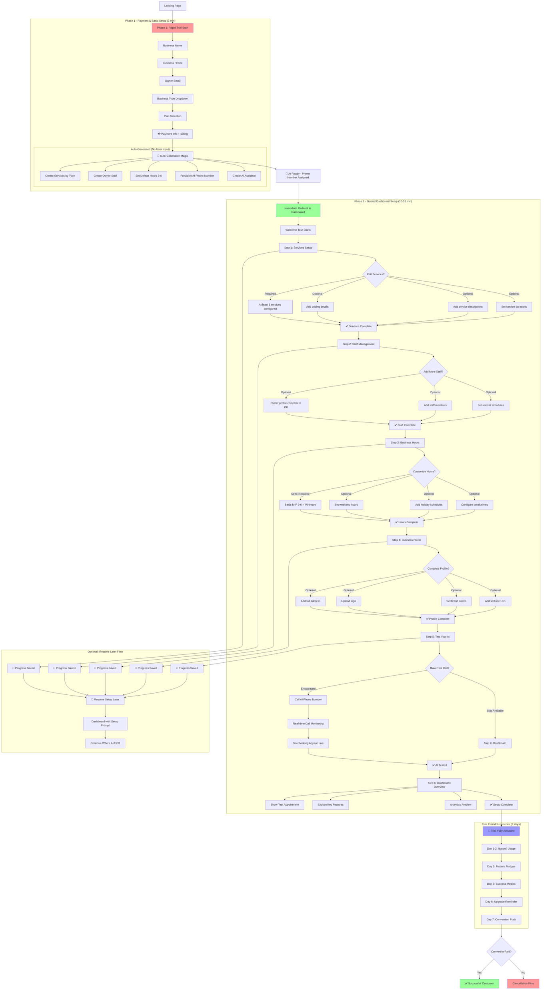

# Two-Phase Onboarding Flow Chart

## 🎯 Complete User Journey Visualization



## 🎯 **REQUIRED vs OPTIONAL Breakdown**

### **✅ ABSOLUTELY REQUIRED (Can't Advance Without)**
| Step | Requirement | Why Critical |
|------|-------------|--------------|
| Phase 1 | Payment Info | Need committed trial user |
| Phase 1 | Basic Business Info | AI needs context to function |
| Step 1 | At least 3 services | AI needs booking options |
| Step 3 | Basic hours (M-F 9-6 minimum) | AI needs availability window |

### **⚠️ SEMI-REQUIRED (Strong Nudge, But Can Skip)**
| Step | Requirement | Skip Consequence |
|------|-------------|------------------|
| Step 2 | Owner profile complete | Works, but no staff context |
| Step 5 | Test call | Miss immediate value demo |
| Step 6 | Dashboard tour | May not understand features |

### **🔓 COMPLETELY OPTIONAL (Nice to Have)**
| Step | Feature | Can Add Later |
|------|---------|---------------|
| Step 1 | Custom service details | ✅ Anytime via dashboard |
| Step 1 | Accurate pricing | ✅ Before going live |
| Step 2 | Additional staff | ✅ As they hire people |
| Step 3 | Weekend hours | ✅ When they want weekend bookings |
| Step 3 | Holiday schedules | ✅ Before holidays |
| Step 4 | Logo/branding | ✅ Anytime for professional look |
| Step 4 | Full address | ✅ Before customer directions needed |

## 🚀 **Skip Strategy Options**

### **Option A: Progressive Disclosure**
```
"Let's get the essentials done first (Steps 1-3)
You can always add more details later"
[Quick Setup] [Complete Setup]
```

### **Option B: Minimum Viable Setup**
```
Required: Services + Hours
Optional: Everything else
"Your AI is ready to take calls!"
```

### **Option C: Guided Priorities**
```
"Let's prioritize what you need most:
▢ Going live today? → Full setup
▢ Just testing? → Quick setup  
▢ Setting up for team? → Staff setup"
```

## 📊 **Resume Points & Progress Tracking**

### **Save Points:**
- After each step completion
- On any field change  
- Before browser close
- On idle timeout

### **Resume Experience:**
```
"Welcome back! You're 60% complete.
Pick up where you left off or start over?"

Progress: ████████████▱▱▱▱
Step 4: Business Profile (2 min remaining)
```

**Which requirements make sense to you? Should we be stricter on some steps or more flexible?**